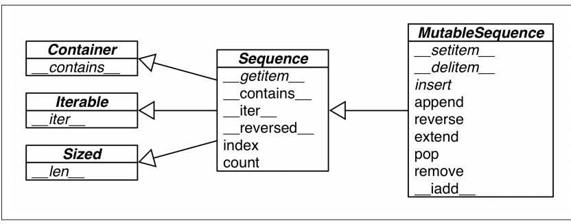
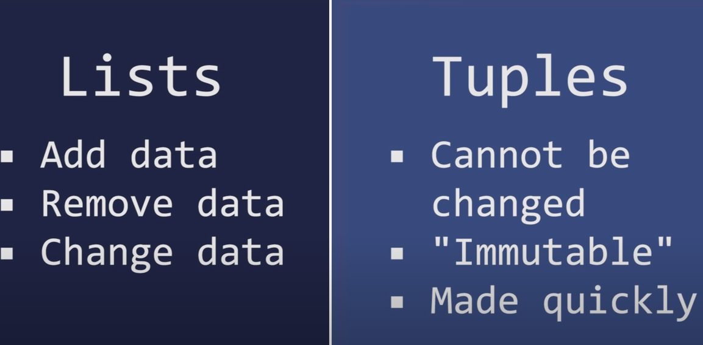

# Data Structure

### **Container sequences**
```list, tuple and collections.deque  can hold items of different types.```

### **Flat sequences**
```str, bytes, bytearray, memoryview and array.array hold items of one type```

Note: Container sequences hold references to the objects,flat sequences physically store the value of each item within its own memory


### **Mutable sequences**
```list, bytearray, array.array, collections.deque and memoryview```

### **Immutable sequences**
```tuple, str and bytes```

----




### **Tuple as record**

#### tuple vs list

